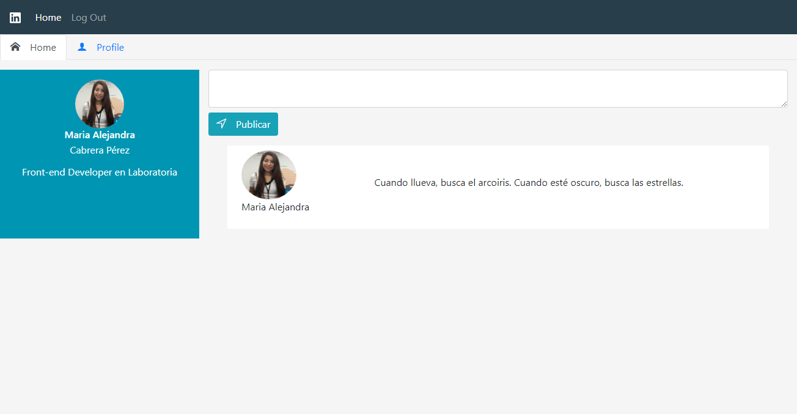
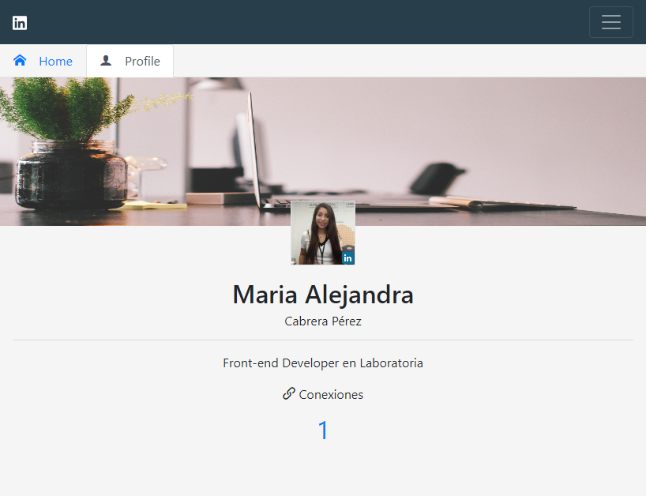
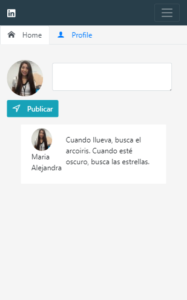
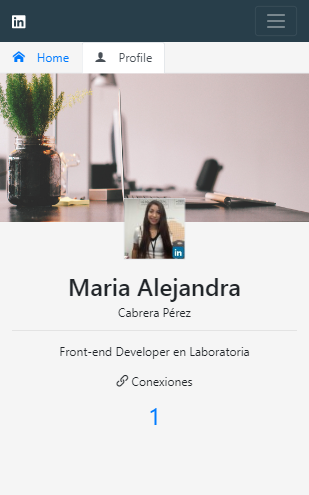

# LINKEDIN
---
## Objetivo

Utilizar la api de Linkedln.

## Flujo de la aplicación

* El usuario puede iniciar sesión con su cuenta de Linkedln a continuación se mostrará una página de perfil.

* La página de perfil cuenta con dos tabs: Home y Profile.

* Home muestra la página de inicio en el cual el usuario puede publicar contenido.  

* Profile muestra el perfil del usuario.

### Versión desktop

;  

;

### Versión Mobile

;

;

#### Desarroladoras

* **Carla Centeno:** [GitHub Account](https://github.com/carlacentenor).
* **Alejandra Cabrera:** [GitHub Account](https://github.com/AlejandraCP).  
